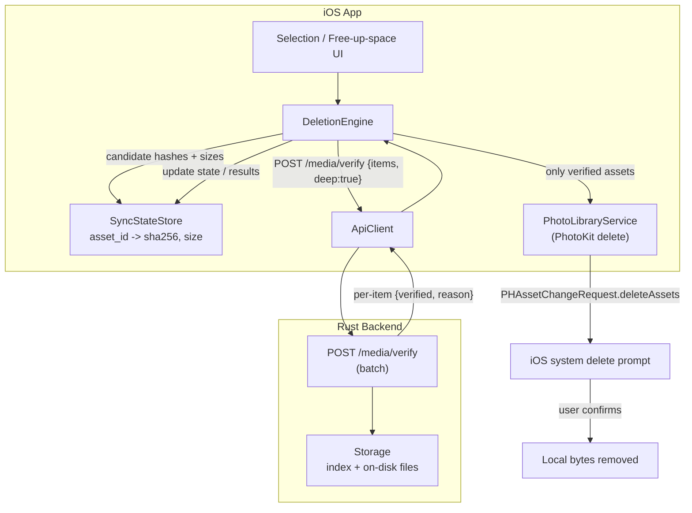
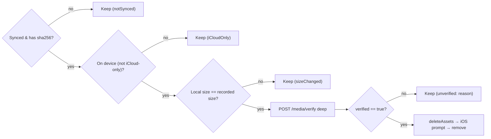

# Delete Synced Items From Device — Technical Design Document

## Introduction

Phone Sync backs up photos/videos to a self-hosted server but never removes them from the phone, so the device fills up even though everything is safely on the server. This feature lets the user reclaim space by deleting local items that are backed up — **but only after the server proves, per item, that it holds the exact, complete file**. Deletion is irreversible (we are removing the only on-device copy), so the design is deliberately conservative: on *any* uncertainty, the item is kept.

Verification is a two-part proof done just before deletion: **identity** (the server's stored content hash equals this asset's hash) and **completeness/integrity** (the file exists on disk, its size matches, and — for certainty — the server re-hashes the on-disk bytes and they still equal the recorded hash). Only items that pass are handed to PhotoKit for deletion, which additionally triggers iOS's own system delete confirmation. The server copy (and thus the Synced view) is untouched.

## Goals and Non-Goals

### Goals
- User can delete backed-up items to free space, from a multi-select in the grid and a bulk "Free up space" action.
- **No item is ever deleted unless the backend confirms it has the exact full item** — content hash match **and** byte-size match, backed by a server-side on-disk re-hash.
- Verification is **batched** (one request per N items) so deleting hundreds is a few round-trips.
- Fail-safe: a missing item, size/hash mismatch, network error, or iCloud-only (not-on-device) asset results in **skip, not delete**, and is surfaced to the user.
- After deletion the item still appears in the **Synced view** (server-backed); local views no longer show it.
- Show bytes to be freed and a per-item result (deleted / kept-because-unverified).

### Non-Goals
- Deleting items **from the server** (this is device-side cleanup only).
- Automatic/background deletion. Deletion is always explicit and user-initiated (plus the iOS system prompt).
- Recovering deleted items (they go to the iOS "Recently Deleted" album for 30 days — that's iOS's safety net, not ours).
- Re-uploading or repairing an item that fails verification (that's the existing sync's job; here we simply don't delete it).
- Detecting bit-rot proactively across the whole library (we only deep-verify items about to be deleted).

## Problem Statement

Today the app uploads and marks items synced, but there is no way to remove local copies. Users with large libraries (many GB of video) can't use the app to reclaim device storage, which is a primary reason to run a self-hosted backup at all. Manually deleting in Photos is unsafe — the user has no per-item guarantee the server actually has a complete, uncorrupted copy, and a partial/failed upload could mean permanent data loss. The impact is: the backup exists but provides no storage relief, and any manual cleanup risks losing photos.

## Architectural Overview



### Verify-then-delete sequence

```mermaid
sequenceDiagram
    participant U as User
    participant DE as DeletionEngine (iOS)
    participant S as Backend
    participant PK as PhotoKit / iOS

    U->>DE: Select items → Delete
    DE->>DE: Gather {asset_id, sha256, size} from SyncStateStore
    DE->>DE: Drop non-synced / iCloud-only / size-mismatch-vs-current-asset
    DE->>S: POST /media/verify {items:[{sha256,size}], deep:true}
    S->>S: For each: index has sha? file exists? size==? re-hash(file)==sha?
    S-->>DE: results:[{sha256, verified, reason}]
    DE->>DE: keep only verified==true
    alt at least one verified
        DE->>PK: deleteAssets(verified localIdentifiers)
        PK->>U: System prompt "Delete N items?"
        U->>PK: Confirm
        PK-->>DE: success
        DE->>DE: remove local records; report freed bytes
    else none verified
        DE->>U: Show "kept" reasons; nothing deleted
    end
```

## Detailed Technical Sections

### What "exact full item" means (the proof)

An item is safe to delete only when **both** hold:

1. **Identity** — the server has content whose `sha256` equals the asset's hash. The asset's hash is the `sha256` recorded in `SyncStateStore` at upload time. PhotoKit asset originals are immutable, so this recorded hash still describes the current bytes. (Optional strict mode: re-hash the local asset before deleting — see Alternatives.)
2. **Completeness + integrity** — on the server, the indexed record for that `sha256` points to a file that (a) exists, (b) has `size` bytes, and (c) **re-hashes on disk to the same `sha256`** (`deep` verification). (c) is what proves the stored copy is the *full, uncorrupted* item and not a truncated/partial file.

Chunked uploads already assemble-and-verify server-side, so a stored large video's index hash is trustworthy; the `deep` re-hash is the belt-and-suspenders check that the bytes are still intact at delete time.

### Components and Interfaces

#### Backend (Rust)

New endpoint (Bearer auth):

| Method | Path | Body | Response |
|---|---|---|---|
| `POST` | `/media/verify` | `{ items: [{ sha256, size }], deep: bool }` | `{ results: [{ sha256, verified, reason }] }` |

`reason` ∈ `ok | not_found | size_mismatch | hash_mismatch | missing_file`. Logic per item:
- `stored = index.record_for(sha256)`; if none → `not_found`.
- resolve absolute path; if missing → `missing_file`.
- `fs::metadata(path).len() != size` → `size_mismatch`.
- if `deep`: stream-hash the file (reuse the chunk-assembly hasher); `!= sha256` → `hash_mismatch`.
- else → `verified: true`.

Deep hashing runs on `spawn_blocking` (CPU/IO bound). Results are independent per item, so a batch can be processed concurrently with a small bound. `deep` is `true` from the delete path; a `false` (index+size only) mode exists for cheap pre-checks/UI.

Storage additions: `record_for(sha256) -> Option<MediaRecord>` (already have `get_by_id`), `verify_on_disk(record, deep) -> VerifyOutcome`.

#### iOS

- **`DeletionEngine`** (`@MainActor`, `ObservableObject`): orchestrates gather → verify → delete; publishes progress and a `DeletionResult` (deleted count, freed bytes, kept `[assetId: reason]`).
- **`ApiClient.verify(items:deep:token:) -> [VerifyResult]`** — POSTs the batch.
- **`PhotoLibraryService.delete(assetLocalIdentifiers:) async throws`** — wraps `PHPhotoLibrary.performChanges { PHAssetChangeRequest.deleteAssets(...) }`; the completion resolves after the **iOS system prompt** is answered (throws/`false` if the user cancels).
- **`PhotoLibraryService.currentResourceSize(asset) -> Int64?`** and on-device check — used to drop iCloud-only assets and pre-filter size mismatches before hitting the server.
- **`SyncStateStore`** — source of `{sha256, size}` per `assetId`; after a confirmed delete, its record is removed (or flagged `deletedLocally`). The Synced view is unaffected (server-backed).
- **UI**: grid multi-select (long-press to enter selection, checkmarks, a Delete action) and a Settings "Free up space" screen showing total reclaimable bytes and a confirm. Both funnel into `DeletionEngine`. A results sheet lists freed space and any kept items with reasons.

Data model (client):
```
struct VerifyRequestItem { let sha256: String; let size: Int64 }
struct VerifyResult { let sha256: String; let verified: Bool; let reason: String }
enum DeletionSkip { case notSynced, iCloudOnly, sizeChanged, unverified(String) }
```

### Data Flows and Security

- **Candidate gating (client-side, before verify):** only items whose `SyncStateStore` state is `.synced` with a non-nil `sha256`; the asset must be on-device (`PHAsset` has a local resource — skip iCloud-only to avoid deleting something whose bytes we can't even confirm are here); the current local resource size must equal the recorded `size` (cheap guard against a changed asset).
- **Server verify is authoritative:** the client deletes *only* `sha256`s the server returned `verified:true` for. A network error, non-2xx, or any item absent from the response ⇒ that item is **kept**.
- **iOS enforces a second gate:** PhotoKit deletion always shows the system confirmation; the app cannot delete silently. If the user cancels, nothing is deleted and state is unchanged.
- **Idempotent + resumable:** re-running verify+delete on already-deleted items is a no-op (they're gone locally). Interruters (app killed mid-flow) leave the server and remaining local items intact.



**Risks & mitigations**
- *Deleting something not truly on the server* → the whole point; mitigated by deep on-disk re-hash + size + identity, and never deleting on partial/failed responses.
- *Hash collision* → sha256; cryptographically negligible.
- *Deep re-hash cost on large videos* → server work is per-delete (deliberate, infrequent), on `spawn_blocking`, batched; a non-`deep` pre-pass can show counts without hashing.
- *Immutable-asset assumption* → PhotoKit originals are immutable; strict mode (client re-hash) available if ever doubted.
- *User expectation* → results sheet clearly states what was kept and why.

## Alternatives Considered

| Decision | Chosen | Alternatives & why not |
|---|---|---|
| Proof of "exact item" | Server **deep re-hash** of on-disk file + size + index hash | *Index existence only:* a partial/corrupt file would pass — unsafe. *Trust upload-time verification only:* doesn't catch later corruption. |
| Where the asset hash comes from | Recorded `sha256` from upload (immutable asset) | *Client re-hash every asset before delete:* strongest but re-exports+hashes multi-GB videos (minutes, heavy IO) for a delete — offered as opt-in **strict mode**, not default. |
| Batch vs per-item verify | **Batch** `/media/verify` | Per-item: N round-trips for a bulk delete; slower, chattier. |
| Deletion mechanism | PhotoKit `deleteAssets` (with iOS prompt) | No alternative on non-jailbroken iOS; also gives us a free user confirmation and a 30-day "Recently Deleted" safety net. |
| Verification granularity | `deep` flag (deep for delete, shallow for previews/counts) | Always-deep: wasted hashing for cheap UI counts. Never-deep: not safe enough for deletion. |

## Testing Strategy

Favor integration/functional tests; the safety tests are the point of the feature.

### Backend (`tests/` against a spawned app)
1. **Verify OK:** upload an item; `POST /media/verify {sha256,size,deep:true}` → `verified:true, reason:ok`.
2. **Not found:** verify a random sha → `verified:false, not_found`.
3. **Size mismatch:** verify a stored sha with the wrong `size` → `size_mismatch`.
4. **Corruption caught (deep):** upload item, then truncate/alter its on-disk file, verify `deep:true` → `hash_mismatch` (and `deep:false` with correct size would pass — demonstrating why deep matters).
5. **Batch:** mixed request (one good, one missing, one wrong-size) → correct per-item results, order-independent.

### iOS
- **Unit (decision logic, pure):** `DeletionEngine.plan(candidates, verifyResults)` returns the exact delete set and per-item skip reasons for: all-verified, some-unverified, item-absent-from-response, network-error (→ all kept). No item marked deletable unless its sha is `verified:true`.
- **Integration (real local backend):** sync a fixture asset → run verify → assert `verified:true`. Then the **safety test**: point at a server that does *not* have the item (fresh data dir / different sha) → assert `DeletionEngine` produces an **empty delete set** and never calls `deleteAssets`.
- **PhotoKit (guarded/simulator):** with photos seeded and permission granted, deleting a verified asset removes it from `fetchAssets()` after the (auto-accepted) system prompt; a canceled prompt leaves it present and records unchanged.
- **Fail-safe matrix:** iCloud-only asset, size-changed asset, and `not_found`/`hash_mismatch` responses each end in *kept*, surfaced with the right reason.

### End-to-end (simulator, required)
Seed photos, sync to a local backend, select items, delete: verify request is sent with `deep:true`, only verified items are removed locally, freed-bytes reported, the items remain visible in the **Synced** view, and a server-missing item is provably never deleted.
