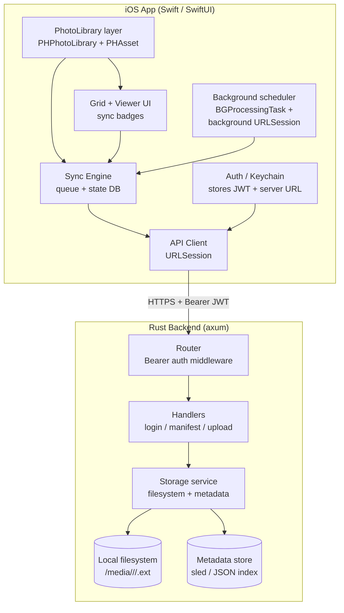
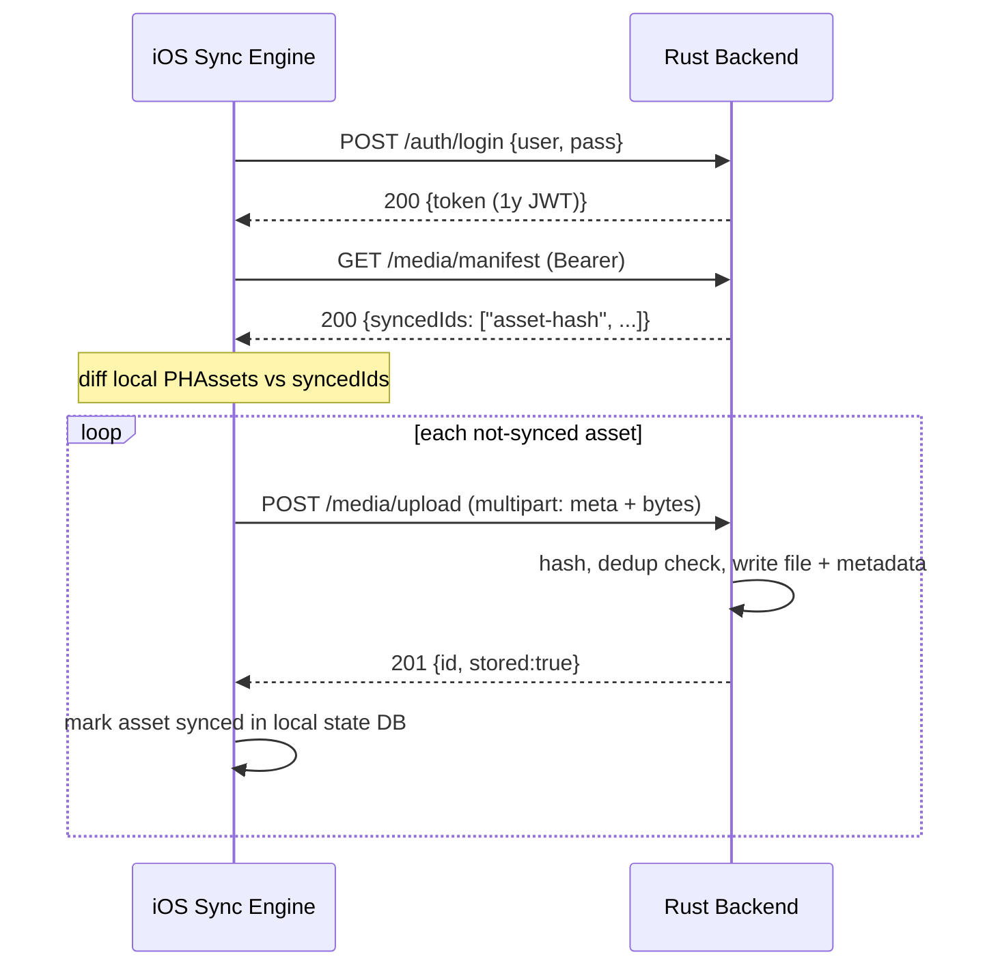

# Phone Sync — Technical Design Document

## Introduction

Phone Sync is a personal photo/video backup system: a native iOS app that uploads the camera roll's photos and videos to a self-hosted server, plus a Rust backend that authenticates the client, accepts media uploads, and stores them on the local filesystem. The iOS UI mimics the Photos app — a scrollable grid of thumbnails that expand to full-screen viewing/playback — with a per-item indicator showing whether each item has been backed up, a manual "Sync now" button, and a sign-in screen.

The goal is opportunistic, near-hands-off backup: as new media is captured, it is uploaded without the user needing to open the app. We develop on macOS (backend reached over `http://<LAN-ip>:<port>`) and ultimately run the backend on a Windows 11 machine reachable at `https://phone.jasonmcaffee.com`. Correctness is verified in the iOS Simulator.

## Goals and Non-Goals

### Goals
- iOS app displays a Photos-style grid of the device's photos **and** videos, newest first, with lazy-loaded thumbnails.
- Tapping an item opens a full-screen viewer; videos play with standard controls.
- Each grid cell shows a sync-state badge: **not synced**, **syncing**, **synced**, **failed**.
- A manual **Sync now** button uploads every not-yet-synced item.
- **Automatic** upload of newly captured media via photo-library change observation (foreground) + background tasks & background `URLSession` (backgrounded), within the limits iOS allows.
- Sign-in screen; backend issues a JWT valid for **1 year**; token stored in the iOS Keychain and sent as `Authorization: Bearer`.
- Backend stores each upload to the local filesystem, is **idempotent** (re-uploading the same asset does not duplicate), and exposes an endpoint to report which assets are already stored.
- Server base URL is configurable at runtime (LAN IP now, `phone.jasonmcaffee.com` later).
- Verified working in the iOS Simulator against a locally running backend.

### Non-Goals
- No literal always-on background process — **not possible on non-jailbroken iOS** (see Alternatives). We rely on OS-scheduled background execution.
- No multi-user system, sign-up flow, or password reset. Credentials are seeded config: user `jason`.
- No cloud storage, CDN, transcoding, dedup-across-users, albums, editing, or deletion sync.
- No end-to-end encryption of media at rest (files stored as-is on a trusted private server).
- No Android client.
- TLS certificate issuance/renewal for `phone.jasonmcaffee.com` is an ops task, out of scope for app code (design accommodates it).

## Problem Statement

Photos and videos captured on the iPhone live only on the device (and optionally iCloud, which is paid/limited and not self-owned). The user wants an **independently owned** backup on hardware they control (a Windows 11 box), populated automatically as media is captured. Today there is no such pipeline: no server endpoint to receive media, no client to send it, no visibility into what has or hasn't been backed up. The impact is risk of permanent data loss on device failure/loss and no self-hosted archive.

## Architectural Overview



### Sync decision flow



## Detailed Technical Sections

### Components and Interfaces

#### Backend (Rust)

Stack: `axum` (HTTP), `tokio` (async runtime), `tower-http` (limits/trace), `jsonwebtoken` (JWT), `argon2` (password verify), `sha2` (content hashing), `serde`, `sled` **or** a JSON index file for metadata. Config via env / `config.toml`.

Storage layout on disk:
```
<data-dir>/
  media/<yyyy>/<mm>/<sha256>.<ext>     # actual bytes, content-addressed
  index/manifest.json  (or sled db)    # asset-id -> {sha256, filename, size, created, contentType}
```

**Asset identity / idempotency:** the client sends a stable `assetId` = the PhotoKit `localIdentifier`, plus the file's `sha256`. The server keys stored records by `sha256` (content-addressed) and also records the `assetId → sha256` mapping. Re-uploading the same bytes is a no-op returning the existing record. This makes uploads safely retryable.

API:

| Method | Path | Auth | Body | Response |
|---|---|---|---|---|
| `GET` | `/health` | none | — | `200 {status:"ok"}` |
| `POST` | `/auth/login` | none | `{username, password}` | `200 {token, expiresAt}` / `401` |
| `GET` | `/media/manifest` | Bearer | — | `200 {assetIds:[...], count}` — assetIds already stored |
| `POST` | `/media/upload` | Bearer | `multipart/form-data`: `metadata` (JSON part) + `file` (binary part) | `201 {id, sha256, stored, duplicate}` |
| `GET` | `/media/{id}` | Bearer | — | `200` streamed bytes (for future/debug) |

`metadata` JSON: `{assetId, filename, contentType, createdAt, mediaType: "photo"|"video", sha256}`.

Auth middleware: validates `Authorization: Bearer <jwt>`, HS256, checks `exp`. Login verifies username == `jason` and Argon2-hashed password. JWT `exp` = now + 365d. Secret from config/env (`PHONE_SYNC_JWT_SECRET`); default generated for dev.

Cross-platform (macOS dev → Windows 11 prod): pure Rust + std `PathBuf`, data-dir configurable, no OS-specific calls. Binds `0.0.0.0:<port>`. Upload body cap (e.g. 2 GB) via `tower-http` / axum `DefaultBodyLimit` and multipart streaming to disk (no full buffering of large videos).

#### iOS app (Swift / SwiftUI)

Layers (mirrors user's layered-architecture preference):
```
PhoneSyncApp/
  App/           App entry, background task registration
  Models/        Asset, SyncState, AuthToken, ServerConfig
  Services/      PhotoLibraryService, ApiClient, AuthService, SyncEngine, KeychainService, SyncStateStore
  Views/         SignInView, MediaGridView, MediaCellView, MediaDetailView, SettingsView
  ViewModels/    GridViewModel, SignInViewModel
  Resources/     Assets, Info.plist
```

Key services:
- **PhotoLibraryService** — requests `PHPhotoLibrary` authorization, fetches `PHAsset`s (images+videos) sorted by `creationDate` desc, produces thumbnails via `PHCachingImageManager`, and registers a `PHPhotoLibraryChangeObserver` to detect new captures. Exports full-resolution data for upload via `PHAssetResourceManager` (originals) / `AVAssetExportSession` fallback.
- **SyncStateStore** — local persistence (a small SQLite or JSON file in App Support) mapping `localIdentifier → {state, sha256, lastAttempt, serverId}`. Source of truth for badges. Reconciled against server manifest on launch/sign-in.
- **ApiClient** — `URLSession` calls; `login`, `fetchManifest`, `upload`. Uses a **background `URLSession`** (`URLSessionConfiguration.background`) for uploads so they continue if the app is suspended.
- **AuthService + KeychainService** — sign-in, stores JWT + server URL in Keychain, injects Bearer header, handles 401 → force re-sign-in.
- **SyncEngine** — computes the not-synced set (local assets − manifest − locally-synced), enqueues uploads, throttles concurrency, updates `SyncStateStore`, drives badges. Triggered by: manual button, library-change observer, background task.
- **Background scheduler** — registers `BGProcessingTaskRequest` (identifier e.g. `com.jasonmcaffee.phonesync.sync`) requiring network; on launch and after each run, schedules the next. Combined with background `URLSession`, this is the OS-sanctioned "runs without opening the app" mechanism. `Info.plist`: `UIBackgroundModes` = `processing`, `fetch`; `BGTaskSchedulerPermittedIdentifiers`; `NSPhotoLibraryUsageDescription`.

Server URL configurable in **SettingsView** (default dev IP, later `https://phone.jasonmcaffee.com`), persisted in Keychain/UserDefaults.

### Data Flows and Security

- **Transport:** dev uses `http://<LAN-ip>:<port>`; the Simulator permits this, but iOS ATS blocks cleartext on device — we add a scoped ATS exception for the dev IP only. Production uses HTTPS at `phone.jasonmcaffee.com` (no exception needed).
- **AuthN:** password hashed with Argon2 server-side; never stored in plaintext. JWT HS256 signed with server secret. Token in Keychain (not UserDefaults).
- **AuthZ:** every `/media/*` route behind Bearer middleware; invalid/expired → 401 → app clears token and shows SignInView.
- **Idempotency & integrity:** SHA-256 content addressing prevents duplicate storage and lets the client verify upload correctness; uploads are retryable.
- **Error handling:** network failure → item marked `failed`, retried next sync cycle with backoff. Partial multipart upload → server writes to a temp file, `fsync`, atomic rename into place; interrupted uploads leave no partial file in `media/`. Large videos streamed, not buffered.
- **Risks:**
  - *iOS background frequency is OS-controlled* — backups may lag until the device is charging/on Wi-Fi. Mitigated by foreground observer + manual button. Documented as accepted.
  - *Secret management* — JWT secret and seeded password hash must be set in prod config, not committed. Dev defaults clearly marked.
  - *Disk exhaustion* on server — return `507` when the data volume is low; surface as `failed` in UI (future hardening).

## Alternatives Considered

| Decision | Chosen | Alternatives & why not |
|---|---|---|
| Keep app alive continuously in background | `BGProcessingTask` + background `URLSession` + library observer | **True always-on daemon:** impossible on non-jailbroken iOS — the OS suspends apps. `location`/`audio` background modes to stay alive: abusive, battery-draining, App Store-rejectable, still not guaranteed. |
| Backend framework | `axum` | `actix-web` (heavier, actor model), `rocket` (less async-native). `axum` is tokio-native, minimal, cross-compiles cleanly to Windows. |
| Media storage | Content-addressed files on local FS + metadata index | **DB blobs (Postgres/SQLite):** worse for large videos, backup, and direct file access. **Object store (S3/MinIO):** overkill for single-user self-host. |
| Metadata store | `sled` or JSON index | Full SQL DB: unnecessary dependency for a key→record map at this scale. (Will start with a simple JSON/sled index; can migrate later.) |
| Asset dedup key | `sha256` of bytes + `localIdentifier` | localIdentifier alone: not stable across re-installs and gives no integrity check. Filename alone: collides. |
| iOS UI | SwiftUI | UIKit: more boilerplate; SwiftUI's `LazyVGrid` + `PhotosUI`/`AVKit` fit the Photos-like grid and viewer directly. |
| Auth token | 1-year JWT in Keychain | Server sessions/refresh tokens: more moving parts than a single-user backup tool needs; user explicitly wants a long-lived token. |

## Testing Strategy

Favor functional/integration/e2e over unit tests.

### Backend (Rust) — integration tests (`tests/` with a spawned axum app + `reqwest`/`tower::ServiceExt`)
1. `POST /auth/login` with `jason` / correct password → 200 + parseable JWT; wrong password → 401.
2. `/media/manifest` and `/media/upload` without/with invalid Bearer → 401.
3. Upload a small image → 201, `stored:true`, `duplicate:false`; file exists on disk at content-addressed path; metadata recorded.
4. Re-upload identical bytes → 201 `duplicate:true`, **no** second file written; manifest count unchanged.
5. Upload photo then video (different content types/extensions) → both retrievable via `GET /media/{id}`; `manifest` lists both assetIds.
6. Manifest reflects exactly the set of uploaded assetIds (drives client diffing).
7. Body-limit / streaming: an oversized upload is rejected cleanly (no OOM, correct status).

Unit tests: JWT sign/verify + expiry math; sha256 path derivation; Argon2 verify.

### iOS — favor functional tests over unit
- **Unit/logic (XCTest):** `SyncEngine` diff logic — given local assets + a manifest + local state, computes the correct not-synced set and state transitions (`notSynced→syncing→synced`/`failed`). `KeychainService` round-trip. `ApiClient` request building (URL, headers, multipart) against a stubbed `URLProtocol`.
- **Integration (XCTest against a real local backend):** boot the Rust server, drive `AuthService.login` → real token; `ApiClient.upload` a fixture asset → assert server has it via manifest; assert `SyncStateStore` marks it synced.
- **UI (XCUITest in Simulator):** sign-in flow (bad creds show error, good creds land on grid); grid renders cells with badges; tapping a cell opens the detail viewer; **Sync now** transitions visible badges to synced. This is the primary end-to-end verification the task requires.

### End-to-end manual verification (required by task)
Run the Rust backend locally, launch the app in the iOS Simulator, seed the simulator's photo library with sample photos/videos, sign in, confirm the grid shows unsynced badges, tap **Sync now**, and confirm badges flip to synced and files appear on the server filesystem. Capture with a Playwright-style XCUITest / screenshots.

## Open Implementation Notes
- Bundle identifier: `com.jasonmcaffee.phonesync` (adjust for signing). Simulator runs unsigned/dev-signed.
- Dev server URL default surfaced in Settings; document how to find the Mac's LAN IP (`ipconfig getifaddr en0`).
- Provide a `run` script / README for starting the backend (`cargo run`) and pointing the app at it.
